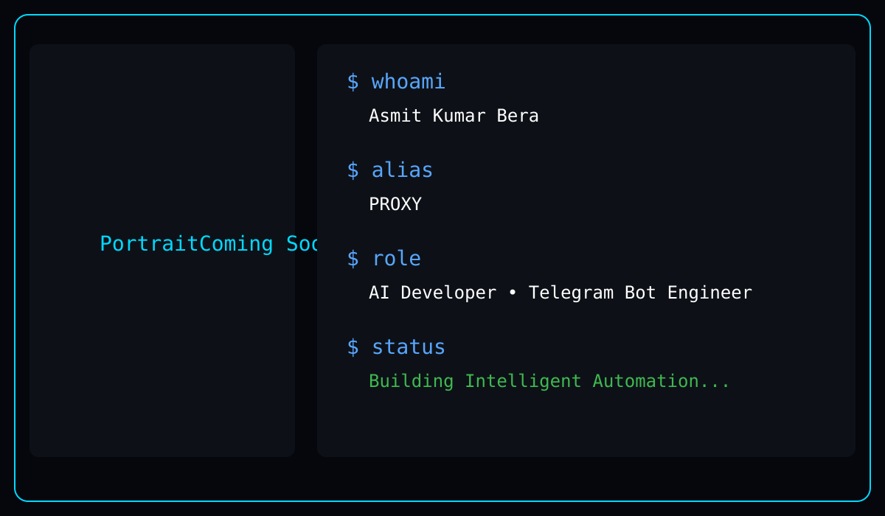

<div align="center">



# 👋 Hi, I'm Asmit Kumar Bera

### AI Developer • Telegram Bot Engineer • Robotics Student

> Building intelligent automation, AI-powered systems, and scalable Telegram infrastructure.

</div>

---

# 🚀 About Me

```text
Name      : Asmit Kumar Bera
Alias     : PROXY
GitHub    : asmit-rm
Telegram  : @REVULET

Focus
• Artificial Intelligence
• Telegram Bot Development
• Automation
• Robotics
```

---

# 🛠 Tech Stack

<p align="center">


</p>

---

# 📊 GitHub Statistics

<p align="center">


</p>

<p align="center">


</p>

<p align="center">


</p>

# 📈 Contribution Graph

<div align="center">


</div>

# 🐍 Contribution Snake

<div align="center">


</div>
# 🚀 Featured Projects

- 🤖 Telegram Bots
- 🧠 AI Projects
- 🌐 Web Applications

---

# 📬 Contact

<p align="center">

<a href="https://t.me/REVULET">

</a>

<a href="https://github.com/asmit-rm">

</a>

</p>

---

<div align="center">

Made with ❤️ by **Asmit Kumar Bera**

</div>
